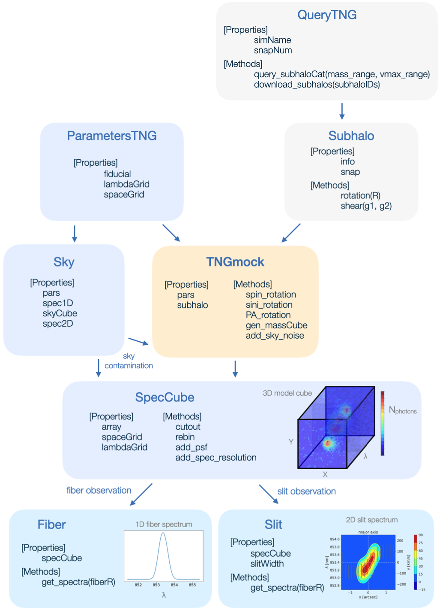

# TNG mock spectrum
A python module to generate mock slit spectra from galaxies in the [IllustrisTNG](https://www.tng-project.org) simulation.

## Overview of this repository

### Code Design

- There are 8 dominant classes in the code structure. The diagram below lists each object's main properties and methods, and their interaction with each other. 

  

### Query the Galaxy/Subhalo information from the IllustrisTNG simulation

- The `QueryTNG` object, defined in [queryTNG.py](./queryTNG.py), is the main class that interacts with the [IllustrisTNG database](https://www.tng-project.org/data/) to handle the search, download, and storage of the simulation data. 

- See this [demo notebook](notebooks/[demo]%20queryTNG.ipynb) on how to use `QueryTNG` to download galaxies with certain selection criteria and visualize the galaxy's basic properties.

- The `Subhalo` is a data class that stores the downloaded galaxy's particle information. One can further rotate and add gravitational shear signal on the galaxy with its associated methods. 

### Generate mock galaxy spectrum

- The `ParametersTNG` class is the parameter object used to store paramters that come into generating mock spectrum. 

- The `Sky` object handles the observational contamination from the sky by adding the atmosphere transmission, sky emissions and the effect of PSF in the model when generating spectrum. 

- The `TNGmock` is the main coordinate class to turn the raw simulation particle information into 3D specturm. The source code can be found in [TNGcube.py](./TNGcube.py).

- The resulting 3D specturm would be stored as the `SpecCube` data class.

- One can then take different observation masks on the 3D spectum to derive the integrated, projected specturm along the line of sight. We currently have `Fiber` and `Slit` observations available in the code. 
 

- Check this [demo notebook](./notebooks/[demo]%20TNGmock.ipynb) on how to use `TNGmock` to generate the mock slit specturm. 
  

## Requirements

This package depends on the following Python libraries:

* [KLens](https://github.com/emhuff/KLens.git)
* [GalSim](https://github.com/GalSim-developers/GalSim)
* [astropy](https://www.astropy.org)
* [rotations](https://github.com/duncandc/rotations)

 Need to include the directory of the [rotations](https://github.com/duncandc/rotations) library in your PYTHONPATH (`export PYTHONPATH=$PYTHONPATH:/your_rotations_libary_dir/` in BASH).